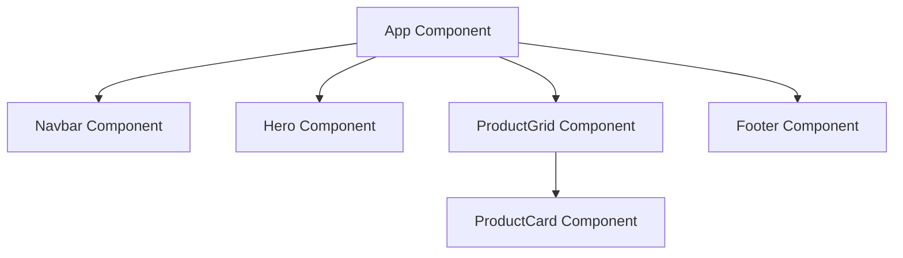

# Sơ đồ cây Component ShopVN

## 1. Sơ đồ cây Component (Mermaid)

## 2. Danh sách Props cần thiết cho mỗi Component

- **Navbar**:
  - `logo` (string): Tên thương hiệu hiển thị trên thanh điều hướng.
  - `links` (array of objects): Mảng các liên kết `{ label: string, href: string }`.
- **Hero**:
  - `title` (string): Tiêu đề chính của phần giới thiệu.
  - `subtitle` (string): Phụ đề/mô tả ngắn.
  - `buttonText` (string): Văn bản hiển thị trên nút kêu gọi hành động.
- **ProductGrid**:
  - `title` (string): Tiêu đề của nhóm sản phẩm (ví dụ: "Sản phẩm nổi bật").
  - `products` (array of objects): Danh sách sản phẩm hiển thị.
- **ProductCard**:
  - `image` (string): Link ảnh sản phẩm.
  - `name` (string): Tên sản phẩm.
  - `price` (string): Giá sản phẩm.
- **Footer**:
  - `text` (string): Nội dung thông tin chân trang (ví dụ: bản quyền).

## 3. Giải thích lý do tách Component

- **Tái sử dụng (Reusability)**: Các component như `Navbar` và `Footer` xuất hiện ở mọi trang trong ứng dụng. Việc tách ra giúp chúng ta chỉ cần viết một lần và tái sử dụng ở bất kỳ trang nào khác mà không cần lặp lại mã nguồn.
- **Dễ bảo trì (Maintainability)**: `ProductCard` được lặp lại nhiều lần. Nếu có thay đổi về thiết kế hay chức năng (ví dụ: thêm nút "Mua ngay"), ta chỉ cần chỉnh sửa tại một nơi duy nhất thay vì sửa đổi hàng loạt.
- **Tách biệt mối quan tâm (Separation of Concerns)**: `ProductGrid` chịu trách nhiệm quản lý layout hiển thị (CSS grid), trong khi `ProductCard` tập trung vào hiển thị chi tiết của một sản phẩm đơn lẻ.
